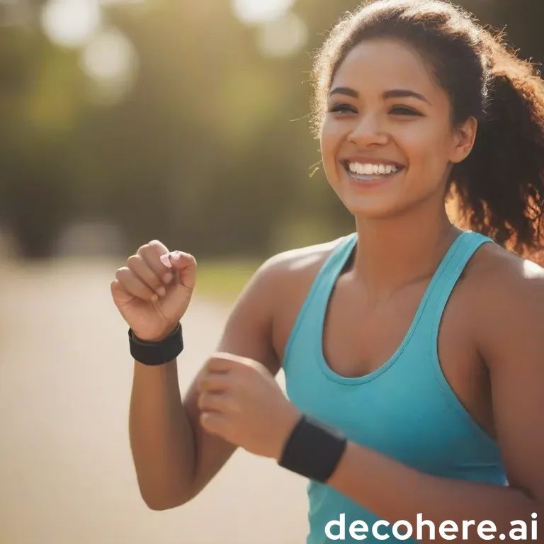

# Round 3: Decohere AI
[Decohere AI](https://www.decohere.ai/) is an online AI tool that **generates images and video** in response to user prompts. Notably, use is limited to **1000 image prompts + 10 video prompts a month.**

Foremerly known as Decoherence.co, *decohere* is a new UW startup backed by Y Combinator, featuring realtime image prompts.

| Media       | Text | Image      | Video        |
|-------------|------|------------|--------------|
| Supported?  | No   | Yes        | Yes          |
| Rating      | 0    | 5          | 3            |
| Time needed | N/A  | 30 minutes | 30 minutes   |

## Getting Started
To start using the tool:
1. Go to https://www.decohere.ai/
2. Click 'Login' and made a new account (Signup with Google)
3. Follow their tutorial
4. Start with image prompts
5. Optional: set image size (Wide, Square, or Tall)

Clicking the + button (Add to Library) will save the image at the bottom of the page where you can download it. A saved image can then be hearted to be added to your Favorites tab.

## Image Prompts
Let's start with the most successful prompt from Round 2's image generating.

*Image Prompt #1*:
* "Happy athlete wearing a smartwatch"
>

This inital image is okay, but I count three smartwatches which is definitely too many.

I saw many images flash past as I typed in my prompt, but it ended on this one. You can also click left and right to see other generated images from the same prompt. I am clicking left to cycle through those images and see if it eventually cycles back to the original or generates new ones. I have cycled left 7 times and I will conclude that it does not circle back to the original.

>

All images appear to be track runners, both male and female, mainly white so far. (This suggests some bias in their training data.) Their poses can be slightly strange, somewhere between in action running down the track and posing for the picture. The main critique is that on most of them, they are actually wearing more than one smartwatch. (When I specified “a” meaning only one in the prompt).

I think I saw better ones before, so I might take away the “smartwatch” part or see if it knows “fitness tracker”.

Let’s also try changing the default image options.

*Image Prompt #2*:
* "Happy athlete wearing a fitness tracker"
* Image size: Square (1:1, Instagram, etc.)
>

There were disappointing results when I first typed in the prompt (no real signs of a fitness tracker and possibly multiple arms in a side picture). But surprisingly, there were much better results once I changed the frame to Square.

Perhaps it really does know what a fitness tracker is better than a smartwatch in terms of an athletics context.

I am satisfied with these images, but with a monthly limit of 1000 images a month (as of time of writing), I am much more confident in my ability to test different prompts.

This time I cycle right. I am curious if I can go back to the left and grab the initial picture on the left? Apparently, I can. That is nice. Being able to simply click on the next available image is kind of fun.

>

On closer inspection it appears that a double watch is still appearing.

Next, I’m interested to see if results change if I select the Tall image frame.

*Image Prompt #3*:
* "Happy athlete wearing a fitness tracker"
* Image size: Tall (9:16, Tiktok, etc.)
>

Entirely new images are generated when switching frames. The page must be zoomed out to see your saved images.

Looking at the new images, you can see the picture tag used when in a photoshoot. (I know from experience since I’ve taken part of one before for a study). Apparently the model has captured that tag, which is an interesting mistake.

Let’s go back to simply “happy athlete.”

*Image Prompt #4*:
* "Happy athlete"
* Image size: Wide (16:9)
>

We get roughly the same images of track runners across all frame sizes.

Time spent: 30 minutes.

## Video Prompts
Let’s get a picture saved in the Favorites tab and try generating a video from it.

1.	Go to the Favorites tab
2.	Click on a picture
3.	Select “Reuse image”
4.	Leave Camera Motion at the default (5.0)
5.	Click Generate Video
6.	Wait for the Queue

Upon refreshing the page, I see the generated output under the all tab.

*Video Prompt #1*:
* (Used a picture from Image Prompt #2)
  
https://github.com/Aaron-Thai/GenAI/assets/91993827/2424135c-8d5f-4aa6-887f-2af161ff02cb

